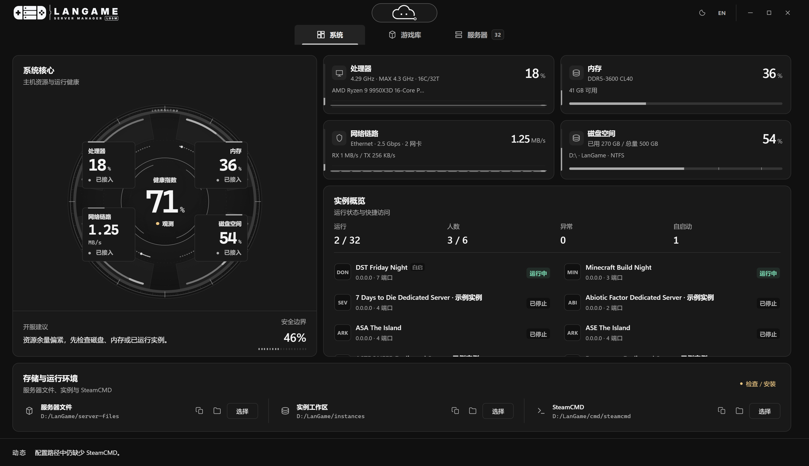
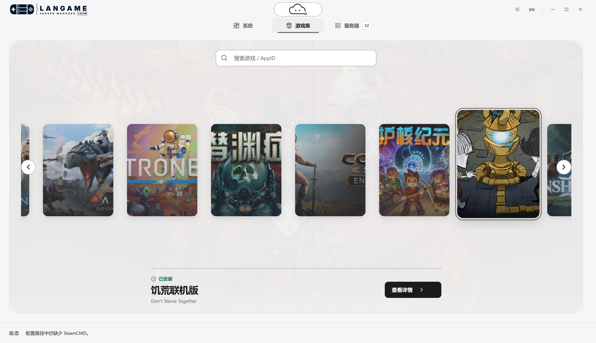
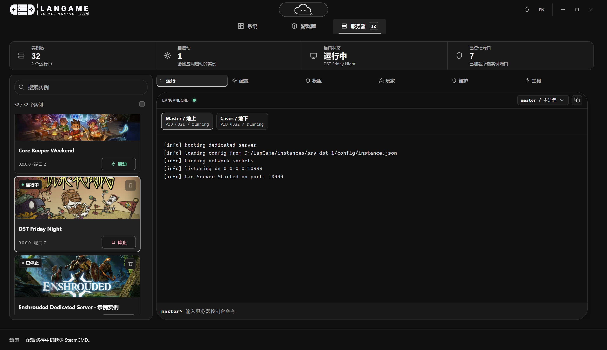

  <a href="https://langame.cn/products/langame-server-manager/"><picture><source media="(prefers-color-scheme: dark)" srcset="assets/logo-dark.svg"></picture></a>
  &nbsp;&nbsp;&nbsp;&nbsp;
  <a href="https://langame.cn/"><picture><source media="(prefers-color-scheme: dark)" srcset="assets/entrogenesis-dark.svg"></picture></a>

# LanGame Server Manager

[简体中文](README.md) | [English](README.en.md)

[Website](https://langame.cn/) · [Product page](https://langame.cn/products/langame-server-manager/) · [Screenshots](#screenshots) · [Supported games](#supported-games) · [LanGame product family](#langame-product-family) · [WeChat](#follow-us-on-wechat)

[LanGame Server Manager](https://langame.cn/products/langame-server-manager/) is a **Windows game server manager for individual hosts and small gaming communities**. Maintain a persistent world for friends or manage several game instances on one machine, with desktop controls for installation, configuration, starting and stopping servers, logs, and backups.

Server files, settings, and saves stay on your machine. No LanGame account is required.

## Screenshots

  

<em>System page: host resources, health, and sample instances.</em>

  

<em>Game library: current templates and sample install status.</em>

  

<em>Servers page: sample instances, runtime status, and console.</em>

Screenshots show the current interface with sample data and do not represent real servers, players, or telemetry.

## Hosting and daily operation

- **Install servers**: select a game and acquire or update its dedicated-server package.
- **Configure each game**: set the server name, player capacity, password, and supported world rules, difficulty, and multipliers. Find settings by their display name or native key.
- **Manage instances**: maintain each instance's configuration, ports, and saves, with server controls, logs, and backups in one workspace.
- **Monitor your host**: view CPU, memory, disk, network, and instance status.
- **Optional LAN AI assistant**: connect the optional AI assistant to a local or remote model provider for help with server hosting and operation.

## Supported games

**32 game server integrations** are available, including Palworld, Minecraft Java Vanilla, Valheim, ARK: Survival Ascended / Survival Evolved, Don't Starve Together, Rust, 7 Days to Die, and Project Zomboid. See the [product page](https://langame.cn/products/langame-server-manager/) for the full list.

## Platform and requirements

LanGame Server Manager runs on **Windows** with **Simplified Chinese and English** interfaces. Each game has its own hardware, storage, network, and runtime requirements. Public connections also require suitable port and firewall configuration.

Some settings take effect only after restarting the server. The LAN AI assistant is optional; model-provider requirements depend on the selected service.

## LanGame product family

Server Manager focuses on Windows hosting and server operation. Related products in the [LanGame](https://langame.cn/products/) family include:

- [LanGame OS Orbit](https://langame.cn/products/langame-os-orbit/): an AI game terminal for PC players, with a game library, classic emulators, LINK multiplayer, and SOFA streaming
- [LanGame OS Stellar](https://langame.cn/products/langame-os-stellar/): an AI venue management platform for esports spaces, coordinating Orbit terminals, game distribution, and seat operations
- [LanGame OS Lunet](https://langame.cn/products/langame-os-lunet/): the SOFA streaming core on Android, for streaming from Orbit on the same network

Hosts can install and start servers with Server Manager; players on the same network can discover and join supported services from Orbit.

## Guides and feedback

- Server guides: [Palworld](https://langame.cn/articles/langame-palworld-server-guide/), [Minecraft](https://langame.cn/articles/langame-minecraft-server-guide/), [Don't Starve Together](https://langame.cn/articles/langame-dst-server-guide/), and [more games](https://langame.cn/hosting/). These guides are in Chinese.
- [Multiplayer and networking guides](https://langame.cn/networking/): local networks, ports, and firewall troubleshooting.
- [Issues](https://github.com/SZSLGJCOM/LanGame-Server-Manager/issues): feature suggestions and product feedback. Keep credentials, private server details, and player information out of public posts.

## Follow us on WeChat

Scan with WeChat to follow **熵灵硅界 (ENTROGENESIS)** and learn about LanGame OS, Server Manager, and other LanGame products.

## About this repository

This repository provides project information. See the [product page](https://langame.cn/products/langame-server-manager/) for installation, guides, and the full game list.

Game names and trademarks belong to their respective owners. No dedicated-server binaries or proprietary game assets are distributed here.
