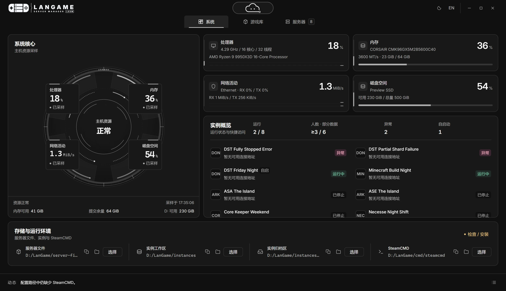

<p align="center">
  <a href="https://langame.cn/products/langame-server-manager/"><picture><source media="(prefers-color-scheme: dark)" srcset="assets/logo-dark.svg"></picture></a>
  &nbsp;&nbsp;&nbsp;&nbsp;
  <a href="https://langame.cn/"><picture><source media="(prefers-color-scheme: dark)" srcset="assets/entrogenesis-dark.svg"></picture></a>
</p>

# LanGame Server Manager

[简体中文](README.md) | [English](README.en.md)

[官网](https://langame.cn/) · [产品页](https://langame.cn/products/langame-server-manager/) · [开服教程](https://langame.cn/hosting/) · [公众号](#关注熵灵硅界)

[LanGame Server Manager](https://langame.cn/products/langame-server-manager/) 是面向 **Windows** 的游戏服务器管理工具。家里或机房里的 Windows 电脑、Windows Server 开服机，都可以在桌面里完成服务端安装、原生配置、多实例启停、日志和备份。

自己开服往往要对付 SteamCMD、配置文件和一堆原生控制台窗口。这里把日常运维收进同一个应用：服务器在后台运行，桌面不堆黑窗口；需要时从托盘打开即可。服务器文件、配置和存档通常保存在运行管理端的电脑上。

<p align="center">
  
</p>

<p align="center"><em>当前界面，示例数据。</em></p>

## 主要功能

当前支持 **32** 款游戏服务器。完整列表见 [产品页](https://langame.cn/products/langame-server-manager/)。

- 安装与更新专用服务器
- 按游戏调整原生配置
- 多实例：端口、存档与启停集中管理
- 主机监控
- 备份与恢复
- 控制台在应用内查看，可最小化到托盘

LAN AI 助手支持自带模型服务（BYOK），可结合日志协助排障。使用时会向你配置的模型服务发送消息和所需诊断信息，详见[隐私说明](PRIVACY.md#简体中文)。

## 下载与安装

前往 [GitHub Releases](https://github.com/SZSLGJCOM/LanGame-Server-Manager/releases) 下载 Windows x64 安装包。安装向导提供简体中文，内置 WebView2 运行时。

程序安装目录与数据目录分开。首次使用会优先选择可写固定非系统盘中可用空间最多的一块，自动创建盘根 `LanGame`；没有可用的其他盘时使用系统盘。无法识别归属的非空 `LanGame` 目录会跳过，不接管或覆盖其中的数据。选定后不会随剩余空间变化，已有数据保留原位、不自动迁移。目录明细见[数据位置说明](docs/desktop-release.md#数据位置与卸载)。

手动安装或卸载前，从系统托盘选择**退出**并等待服务器停止。卸载保留游戏数据、服务器设置、数据库、旧数据和位置记录；可选的界面数据清理会重置语言、主题、模型服务配置等界面设置。

## 运行环境

支持 **Windows 10 / 11** 和 **Windows Server**，界面为简体中文和英文。各游戏对硬件、存储和网络的要求不同。公网联机还需配置端口与防火墙；同一局域网，以及 Radmin VPN、Hamachi 这类组网软件组成的虚拟局域网，可按检测到的网卡绑定联机地址。部分设置需重启服务器后生效。

## 使用与授权

- 仅限非商业用途；收费游戏服、商家使用及商业服务须另获书面授权。
- 可以私下修改并向官方提交改进，不得自行发布修改版。
- 可以免费转发官方已公开的完整原版发行包，须保留许可与声明。

[许可条款](LICENSE) · [品牌规则](NOTICE) · [贡献指南](CONTRIBUTING.md#简体中文) · [贡献协议](CONTRIBUTOR_AGREEMENT.md#简体中文) · [授权申请](https://github.com/SZSLGJCOM/LanGame-Server-Manager/issues/new?template=contact_request.yml)

## 教程与反馈

- 开服教程：[幻兽帕鲁](https://langame.cn/articles/langame-palworld-server-guide/)、[Minecraft](https://langame.cn/articles/langame-minecraft-server-guide/)、[饥荒联机版](https://langame.cn/articles/langame-dst-server-guide/)，以及[更多游戏](https://langame.cn/hosting/)
- [联机教程](https://langame.cn/networking/)
- [Issues](https://github.com/SZSLGJCOM/LanGame-Server-Manager/issues)：功能建议和项目反馈。请勿在公开内容中填写凭据、私有服务器信息或玩家数据

## LanGame 产品系列

Server Manager 负责 Windows 开服与运维。同属 [LanGame 聚域游](https://langame.cn/products/) 的还有：

- [LanGame OS Orbit](https://langame.cn/products/langame-os-orbit/)：面向 PC 玩家的 AI 游戏终端，汇集游戏库、经典模拟器、LINK 联机与 SOFA 串流
- [LanGame OS Stellar](https://langame.cn/products/langame-os-stellar/)：面向电竞空间与专业场馆的 AI 管理平台，统筹 Orbit 终端、游戏分发与席位运营
- [LanGame OS Lunet](https://langame.cn/products/langame-os-lunet/)：把 SOFA 串流核心放进 Android，与同一网络中的 Orbit 串流

服主可用 Server Manager 安装与启动服务器；同网玩家可在 Orbit 中发现并加入受支持的服务。

## 关注熵灵硅界

微信扫码关注 **熵灵硅界** 公众号。

<a href="assets/wechat-official-account.jpg"></a>

## 从源码运行

需要 Git、Rust `1.99.0`（MSVC）、Node.js `>=26.10.0 <27`、npm `>=12.2.0 <13`，以及 Python 3.11 以上版本。C++ Build Tools 和 WebView2 的安装方式见 [Tauri 前置条件](https://v2.tauri.app/start/prerequisites/)。

<details>
<summary>展开构建、运行和打包命令</summary>

在仓库根目录先安装 `packageManager` 固定的 npm 版本，再安装依赖并检查工作区。Node.js 附带的 npm 版本可能与项目要求不同：

```powershell
$packageManager = (Get-Content apps/desktop/package.json -Raw | ConvertFrom-Json).packageManager
npm install --global $packageManager
npm --version
npm ci --prefix apps/desktop --strict-allow-scripts
npm --prefix apps/desktop run build
cargo check --workspace --locked
```

启动前端开发服务器：

```powershell
npm --prefix apps/desktop run dev
```

在第二个终端启动桌面进程：

```powershell
cargo run --locked --manifest-path apps/desktop/src-tauri/Cargo.toml --bin langame-desktop
```

生成本地安装包（默认关闭联网更新检查，无需发行签名密钥）：

```powershell
cargo install tauri-cli --version "=2.12.1" --locked
Push-Location apps/desktop
try {
    cargo tauri build -- --locked
    if ($LASTEXITCODE -ne 0) { throw "Tauri build failed." }
}
finally {
    Pop-Location
}
```

首次构建需要下载依赖及 WebView2 安装程序。签名发行的配置见[发行指南](docs/desktop-release.md)。

</details>

## 关于本仓库

本仓库提供 LanGame Server Manager 源码、构建工具和[使用文档](docs/README.md)，采用 [LanGame Source-Available License 1.0](LICENSE)。[第三方声明](THIRD_PARTY_NOTICES.md)。
