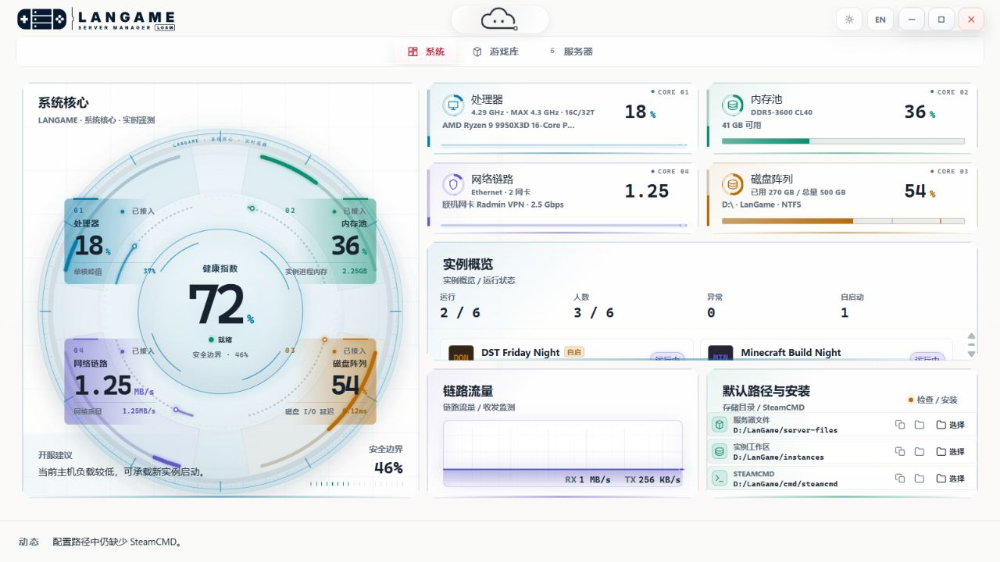
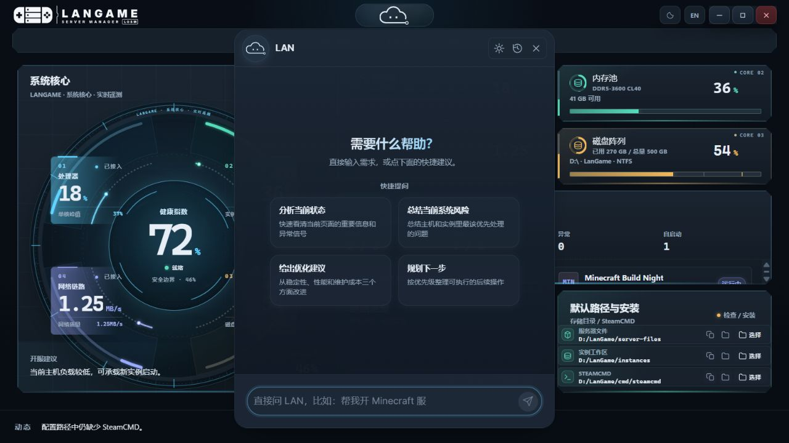

<picture>
  <source media="(prefers-color-scheme: dark)" srcset="assets/logo-dark.svg">
  
</picture>

# LanGame Server Manager

[English](README.md) | [简体中文](README.zh-CN.md)

面向 Windows 的游戏服务器管理工具。在一个桌面工作区中完成服务端安装、配置和日常管理，服务器文件、设置、日志与备份均保留在本机。

## 主要功能

- **安装与更新**：通过受支持的游戏模块获取和更新专用服务器。
- **多实例管理**：为不同实例分别管理文件、端口和游戏原生设置。
- **日常运维**：在同一工作区内启停服务器、查看日志和创建备份。
- **主机监控**：查看 CPU、内存、磁盘、网络与实例运行状态。
- **玩家管理**：使用对应游戏支持的玩家查询和管理员操作。
- **LAN 助手**：按需连接本地或远程模型服务，辅助处理开服与运维问题。

## 界面展示

### 系统概览

在同一桌面工作区查看主机资源和游戏实例状态。

### LAN 助手

从应用顶部打开 LAN，直接询问服务器运维相关问题。

*截图使用演示数据，不包含真实服务器、玩家或工作站监控数据。*

## 游戏集成

当前包含 **32 款游戏的服务器集成**，其中包括：

- 幻兽帕鲁
- Minecraft
- Valheim
- ARK: Survival Ascended 与 ARK: Survival Evolved
- 饥荒联机版
- Rust
- 七日杀
- 僵尸毁灭工程

可用设置、玩家查询和管理员操作因游戏及服务端版本而异。不同游戏对硬件、存储、网络和专用服务器运行环境也有各自要求。

## 平台与语言

支持 **Windows**，提供**简体中文和英文**界面。应用在本机运行，无需 LanGame 账号。LAN 为可选功能，模型服务的使用条件取决于所选服务。

## 关于本仓库

本仓库用于项目介绍与界面展示，不包含应用源码或安装包。

可以关注仓库了解项目信息，或通过 [Issues](https://github.com/SZSLGJCOM/LanGame-Server-Manager/issues) 提交功能建议。请勿在公开内容中填写凭据、私有服务器信息或玩家数据。

游戏名称和商标归各自权利人所有。本仓库不分发专用服务器二进制文件或专有游戏资产。
